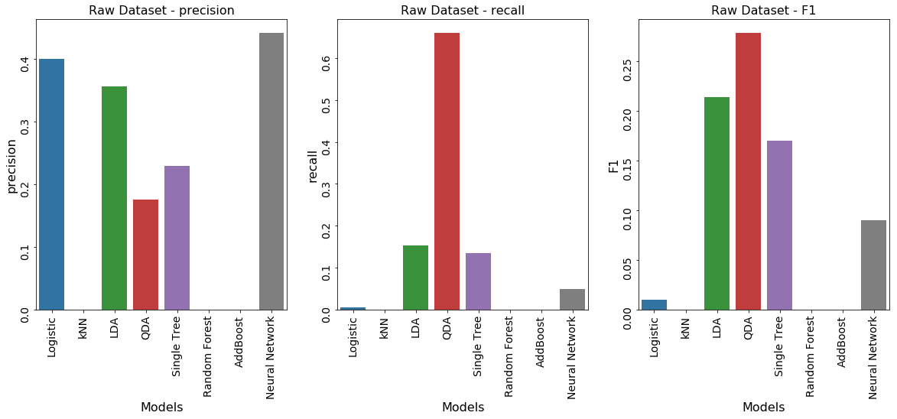
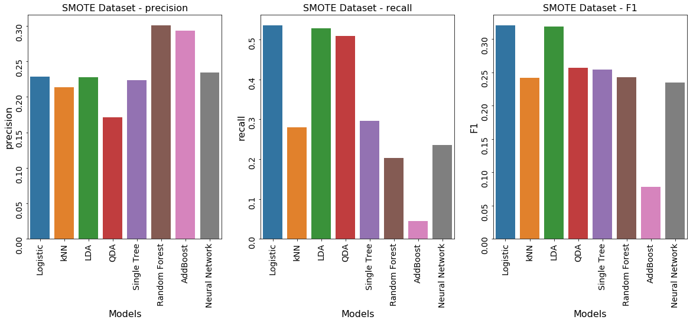
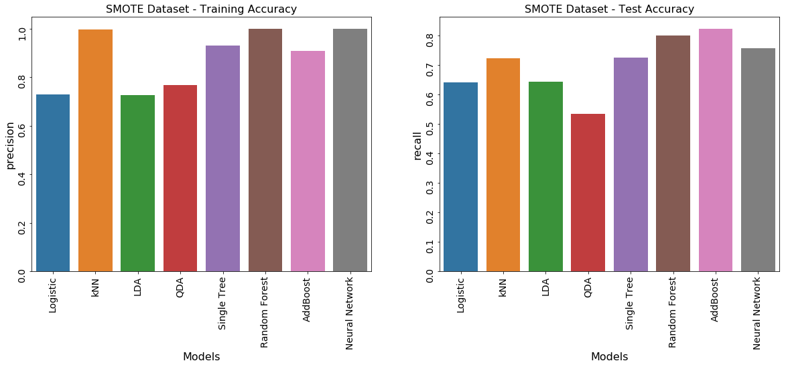

## Contents
{:.no_toc}
*  
{: toc}


```python
import pandas as pd
import numpy as np
import matplotlib
import matplotlib.pyplot as plt

from sklearn.preprocessing import PolynomialFeatures

import warnings
warnings.filterwarnings('ignore')

import seaborn as sns
pd.set_option('display.width', 500)
pd.set_option('display.max_columns', 500)

% matplotlib inline
```


```python
results = pd.read_csv("data/results.csv")
results_sm = pd.read_csv("data/results_sm.csv")
```


## Results

### Raw dataset


```python
f, ax = plt.subplots(1, 3, figsize=(20,7))

g1 = sns.barplot(results['model'], results['precision'], data=results, ax=ax[0])
g1.set_title('Raw Dataset - precision', fontsize=16)
g1.set_xlabel('Models', fontsize=16)
g1.set_ylabel('precision', fontsize=16)
g1.tick_params(labelsize=14, rotation=90)

g2 = sns.barplot(results['model'], results['recall'], data=results, ax=ax[1])
g2.set_title('Raw Dataset - recall', fontsize=16)
g2.set_xlabel('Models', fontsize=16)
g2.set_ylabel('recall', fontsize=16)
g2.tick_params(labelsize=14, rotation=90)

g3 = sns.barplot(results['model'], results['F1'], data=results, ax=ax[2])
g3.set_title('Raw Dataset - F1', fontsize=16)
g3.set_xlabel('Models', fontsize=16)
g3.set_ylabel('F1', fontsize=16)
g3.tick_params(labelsize=14, rotation=90)
```





```python
f, ax = plt.subplots(1, 2, figsize=(20,7))

g1 = sns.barplot(results['model'], results['train_acc'], data=results, ax=ax[0])
g1.set_title('Raw Dataset - Training Accuracy', fontsize=16)
g1.set_xlabel('Models', fontsize=16)
g1.set_ylabel('precision', fontsize=16)
g1.tick_params(labelsize=14, rotation=90)

g2 = sns.barplot(results['model'], results['test_acc'], data=results, ax=ax[1])
g2.set_title('Raw Dataset - Test Accuracy', fontsize=16)
g2.set_xlabel('Models', fontsize=16)
g2.set_ylabel('recall', fontsize=16)
g2.tick_params(labelsize=14, rotation=90)
```


### SMOTE Dataset


```python
f, ax = plt.subplots(1, 3, figsize=(20,7))

g1 = sns.barplot(results_sm['model'], results_sm['precision'], data=results_sm, ax=ax[0])
g1.set_title('SMOTE Dataset - precision', fontsize=16)
g1.set_xlabel('Models', fontsize=16)
g1.set_ylabel('precision', fontsize=16)
g1.tick_params(labelsize=14, rotation=90)

g2 = sns.barplot(results_sm['model'], results_sm['recall'], data=results_sm, ax=ax[1])
g2.set_title('SMOTE Dataset - recall', fontsize=16)
g2.set_xlabel('Models', fontsize=16)
g2.set_ylabel('recall', fontsize=16)
g2.tick_params(labelsize=14, rotation=90)

g3 = sns.barplot(results_sm['model'], results_sm['F1'], data=results_sm, ax=ax[2])
g3.set_title('SMOTE Dataset - F1', fontsize=16)
g3.set_xlabel('Models', fontsize=16)
g3.set_ylabel('F1', fontsize=16)
g3.tick_params(labelsize=14, rotation=90)
```





```python
f, ax = plt.subplots(1, 2, figsize=(20,7))

g1 = sns.barplot(results_sm['model'], results_sm['train_acc'], data=results_sm, ax=ax[0])
g1.set_title('SMOTE Dataset - Training Accuracy', fontsize=16)
g1.set_xlabel('Models', fontsize=16)
g1.set_ylabel('precision', fontsize=16)
g1.tick_params(labelsize=14, rotation=90)

g2 = sns.barplot(results_sm['model'], results_sm['test_acc'], data=results_sm, ax=ax[1])
g2.set_title('SMOTE Dataset - Test Accuracy', fontsize=16)
g2.set_xlabel('Models', fontsize=16)
g2.set_ylabel('recall', fontsize=16)
g2.tick_params(labelsize=14, rotation=90)
```





## Conclusions

## Future Work
