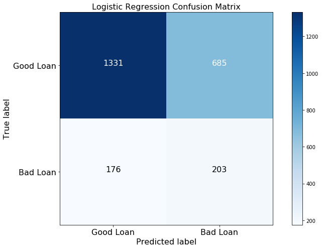
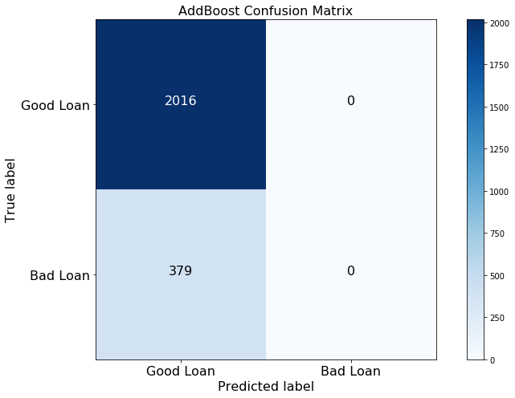

## Contents
{:.no_toc}
*  
{: toc}


```python
import pandas as pd
import numpy as np
import matplotlib
import matplotlib.pyplot as plt
import itertools
from imblearn.over_sampling import SMOTE

from sklearn.model_selection import train_test_split
from sklearn.preprocessing import StandardScaler

import statsmodels.api as sm
from statsmodels.api import OLS
from sklearn.linear_model import LogisticRegression
from sklearn.linear_model import LogisticRegressionCV
from sklearn.discriminant_analysis import LinearDiscriminantAnalysis
from sklearn.discriminant_analysis import QuadraticDiscriminantAnalysis
from sklearn.neighbors import KNeighborsClassifier
from sklearn.tree import DecisionTreeClassifier
from sklearn.ensemble import RandomForestClassifier
from sklearn.ensemble import AdaBoostClassifier

from sklearn.model_selection import train_test_split
from sklearn.model_selection import cross_val_score

from sklearn.metrics import precision_recall_fscore_support
from sklearn.metrics import confusion_matrix
from sklearn.metrics import accuracy_score

import warnings
warnings.filterwarnings('ignore')

import keras 
from keras.models import Sequential
from keras.layers import Dense
from keras.utils import to_categorical

import seaborn as sns
pd.set_option('display.width', 500)
pd.set_option('display.max_columns', 500)

% matplotlib inline
```


    Using TensorFlow backend.
    

## Data Preparation
There are too many observations in the dataset, which will take hours or even days to fit for some sophisticated algorithms. Thus, we decided to take a stratified sample on year of raw dataset in the model fitting stage. 


```python
df_fe = pd.read_csv("data/output_fe.csv")
print("Shape of the raw input file: {}".format(df_fe.shape))
```


    Shape of the raw input file: (95765, 196)
    


```python
df_clean = df_fe.copy(deep=True)
df_clean = df_fe.groupby('year', group_keys=False).apply(lambda x: x.sample(frac=0.05, random_state=99))
df_clean.drop(['year'], axis=1, inplace=True)

print("Shape of the clean input file: {}".format(df_clean.shape))
```


    Shape of the clean input file: (4789, 195)
    

### Stratified Sampling
We split training  and test dataset by stratifing on the response variable.


```python
df_train, df_test = train_test_split(df_clean, 
                                     test_size = .5, 
                                     stratify = df_clean['response'], 
                                     random_state=90)

print("Shape of the training set: {}".format(df_train.shape))
print("Shape of the test set: {}".format(df_test.shape))
```


    Shape of the training set: (2394, 195)
    Shape of the test set: (2395, 195)
    


```python
def split_columns(df, target_col, drop_columns):
    # Get the response variable
    y_train = df[[target_col]]

    # Drop the required columns
    X_train = df.drop(drop_columns, axis=1)
    
    return X_train, y_train
```


```python
X_train, y_train = split_columns(df_train, target_col='response', drop_columns=['response'])
X_test, y_test = split_columns(df_test, target_col='response', drop_columns=['response'])
```


### Standardization
We standardize all the predictors that are not dummy variables. 


```python
def scale_datasets(train_data, test_data, cols_to_scale):
    train = train_data.copy()
    test = test_data.copy()
    
    # Fit the scaler on the training data
    scaler = StandardScaler().fit(train[cols_to_scale])

    # Scale both the test and training data. 
    train[cols_to_scale] = scaler.transform(train[cols_to_scale])
    test[cols_to_scale] = scaler.transform(test[cols_to_scale])
    
    return train, test
```


```python
X_train, X_test = scale_datasets(X_train, X_test, list(X_train.columns))
```


### Custom Functions 


```python
def plot_confusion_matrix(cm, classes,
                          normalize=False,
                          title='Confusion matrix',
                          cmap=plt.cm.Blues,
                          fontsize=16):
    """
    This function plots the confusion matrix.
    Normalization can be applied by setting `normalize=True`.
    """
    if normalize:
        cm = cm.astype('float') / cm.sum(axis=1)[:, np.newaxis]

    plt.imshow(cm, interpolation='nearest', cmap=cmap)
    plt.title(title, fontsize=fontsize)
    plt.colorbar()
    tick_marks = np.arange(len(classes))
    plt.xticks(tick_marks, classes, fontsize=fontsize)
    plt.yticks(tick_marks, classes, fontsize=fontsize)

    fmt = '.2f' if normalize else 'd'
    thresh = cm.max() / 2.
    for i, j in itertools.product(range(cm.shape[0]), range(cm.shape[1])):
        plt.text(j, i, format(cm[i, j], fmt),
                 horizontalalignment="center",
                 color="white" if cm[i, j] > thresh else "black",
                 fontsize=fontsize)

    plt.ylabel('True label', fontsize=fontsize)
    plt.xlabel('Predicted label', fontsize=fontsize)
    plt.tight_layout()
```


## Classification of Good and Bad Loans

### Baseline Model
For classification, a simple baseline is always predicting the most common class, which is good loans in our dataset. 


```python
base_train_acc = y_train.response.value_counts()[0] / len(y_train)
base_test_acc = y_test.response.value_counts()[0] / len(y_test)
print("Baseline model accuracy in training set: {:.2%}".format(base_train_acc))
print("Baseline model accuracy in test set: {:.2%}".format(base_test_acc))
```


    Baseline model accuracy in training set: 84.17%
    Baseline model accuracy in test set: 84.18%
    

### Oversampling 
As we can see from the baseline model accuracy, the lending club dataset is an imbalanced one with 84% of majority class and only 16% minority class. A common problem with imbalanced dataset is that the model will simply predict the majority class with a high accuracy score and ignore the minority class. However, accuracy or precision may not be the only concern we have as data scientists. 

For example, if we were building a model for cancer detection, we would want to capture all the patients that do have cancer, even at the cost of some misclassification of heathy people, as these people can be examined futher by doctors. As investors on lending club, what we really care about is the default risk. The key question we need to ask ourselves is that among all the bad loans, how many of them we can predict correctly? This is the so called recall rate.

Oversampling is a technique that can deal with this imbalanced dataset. The basic idea is to over sample the minority class,  so that the model can achieve higher recall at the cost of precision, and that's exactly what we want. In the modeling stage, We used Synthetic Minority Oversampling Technique (SMOTE) to oversample the training set. 


```python
sm = SMOTE(random_state=12, ratio = 1.0)
X_train_sm, y_train_sm = sm.fit_sample(X_train, y_train)
print("Oversampled Training Set:\nNumber of bad loans: {}\nNumber of good loans: {}".format(
    np.count_nonzero(y_train_sm == 1), np.count_nonzero(y_train_sm == 0))  
)
```


    Oversampled Training Set:
    Number of bad loans: 2015
    Number of good loans: 2015
    

### Logistic Regression 

<b> Raw training set </b>


```python
logit = LogisticRegressionCV(cv=5, random_state=0, penalty='l2').fit(X_train, y_train)

train_acc = logit.score(X_train, y_train)
test_acc = logit.score(X_test, y_test)
report_lr = precision_recall_fscore_support(y_test, logit.predict(X_test), average='binary')

logit_results = {
    'model': 'Logistic',
    'train_acc': train_acc,
    'test_acc': test_acc,
    'precesion': report_lr[0],
    'recall': report_lr[1],
    'F1': report_lr[2]
}

print('Logistic Regression: accuracy on train={:.2%}, test={:.2%}, precision={:.2f}, recall={:.2f}, F1={:.2f}'.
      format(logit_results['train_acc'], 
             logit_results['test_acc'], 
             logit_results['precesion'], 
             logit_results['recall'], 
             logit_results['F1']))
```


    Logistic Regression: accuracy on train=84.34%, test=84.13%, precision=0.40, recall=0.01, F1=0.01
    


```python
cnf_matrix = confusion_matrix(y_test, logit.predict(X_test))
np.set_printoptions(precision=2)

plt.figure(figsize=(11,7))
plot_confusion_matrix(cnf_matrix, classes=["Good Loan", "Bad Loan"], normalize=False,
                      title='Logistic Regression Confusion Matrix')

plt.show()
```


<b> Oversampled Training set </b>


```python
logit_sm = LogisticRegressionCV(cv=5, random_state=0, penalty='l2').fit(X_train_sm, y_train_sm)

train_acc, test_acc = logit_sm.score(X_train_sm, y_train_sm), logit_sm.score(X_test, y_test)
report_lr = precision_recall_fscore_support(y_test, logit_sm.predict(X_test), average='binary')

logit_sm_results = {
    'model': 'Logistic',
    'train_acc': train_acc,
    'test_acc': test_acc,
    'precesion': report_lr[0],
    'recall': report_lr[1],
    'F1': report_lr[2]
}

print('Logistic Regression: accuracy on train={:.2%}, test={:.2%}, precision={:.2f}, recall={:.2f}, F1={:.2f}'.
      format(logit_sm_results['train_acc'], 
             logit_sm_results['test_acc'], 
             logit_sm_results['precesion'], 
             logit_sm_results['recall'], 
             logit_sm_results['F1']))
```


    Logistic Regression: accuracy on train=73.05%, test=64.05%, precision=0.23, recall=0.54, F1=0.32
    


```python
cnf_matrix = confusion_matrix(y_test, logit_sm.predict(X_test))
np.set_printoptions(precision=2)

plt.figure(figsize=(11,7))
plot_confusion_matrix(cnf_matrix, classes=["Good Loan", "Bad Loan"], normalize=False,
                      title='Logistic Regression Confusion Matrix')

plt.show()
```





### kNN 

<b> Raw training set </b>


```python
max_score = 0
max_k = 0 
scores = []

for k in range(1, 21):
    knn = KNeighborsClassifier(n_neighbors = k)
    score = cross_val_score(knn, X_train, y_train, cv=5).mean()
    
    scores.append(score)
    if score > max_score:
        max_k = k
        max_score = score
        
scores = pd.DataFrame({'k': range(1, 21), 'accuracy': scores})
```


```python
fig, ax = plt.subplots(1, 1, figsize=(11, 7))
ax.plot(scores['k'], scores['accuracy'], alpha=0.5, label='training set')  
ax.set_title('kNN Cross-Validation Accuracy', fontsize=16)
ax.set_xlabel('k', fontsize=16)
ax.set_ylabel('Accuracy', fontsize=16)
ax.legend(fontsize=16)
ax.tick_params(labelsize=16)
plt.show()
```


```python
knn = KNeighborsClassifier(n_neighbors = max_k)
knn.fit(X_train, y_train)

train_acc, test_acc = knn.score(X_train, y_train), knn.score(X_test, y_test)

print('kNN: Optimal k={}'.format(max_k))

report_lr = precision_recall_fscore_support(y_test, knn.predict(X_test), average='binary')

knn_results = {
    'model': 'kNN',
    'train_acc': train_acc,
    'test_acc': test_acc,
    'precesion': report_lr[0],
    'recall': report_lr[1],
    'F1': report_lr[2]
}

print('kNN: accuracy on train={:.2%}, test={:.2%}, precision={:.2f}, recall={:.2f}, F1={:.2f}'.
      format(knn_results['train_acc'], 
             knn_results['test_acc'], 
             knn_results['precesion'], 
             knn_results['recall'], 
             knn_results['F1']))
```


    kNN: Optimal k=18
    kNN: accuracy on train=84.21%, test=84.05%, precision=0.00, recall=0.00, F1=0.00
    


```python
cnf_matrix = confusion_matrix(y_test, knn.predict(X_test))
np.set_printoptions(precision=2)

plt.figure(figsize=(11,7))
plot_confusion_matrix(cnf_matrix, classes=["Good Loan", "Bad Loan"], normalize=False,
                      title='kNN Confusion Matrix')

plt.show()
```


<b> Oversampled Training set </b>


```python
max_score = 0
max_k = 0 
scores = []

for k in range(1, 21):
    knn = KNeighborsClassifier(n_neighbors = k)
    score = cross_val_score(knn, X_train_sm, y_train_sm, cv=5).mean()
    
    scores.append(score)
    if score > max_score:
        max_k = k
        max_score = score
        
scores = pd.DataFrame({'k': range(1, 21), 'accuracy': scores})
```


```python
fig, ax = plt.subplots(1, 1, figsize=(11, 7))
ax.plot(scores['k'], scores['accuracy'], alpha=0.5, label='training set')  
ax.set_title('kNN Cross-Validation Accuracy', fontsize=16)
ax.set_xlabel('k', fontsize=16)
ax.set_ylabel('Accuracy', fontsize=16)
ax.legend(fontsize=16)
ax.tick_params(labelsize=16)
plt.show()
```


```python
knn_sm = KNeighborsClassifier(n_neighbors = max_k)
knn_sm.fit(X_train_sm, y_train_sm)

train_acc, test_acc = knn_sm.score(X_train_sm, y_train_sm), knn_sm.score(X_test, y_test)

print('kNN: Optimal k={}'.format(max_k))

report_lr = precision_recall_fscore_support(y_test, knn_sm.predict(X_test), average='binary')

knn_sm_results = {
    'model': 'kNN',
    'train_acc': train_acc,
    'test_acc': test_acc,
    'precesion': report_lr[0],
    'recall': report_lr[1],
    'F1': report_lr[2]
}

print('kNN: accuracy on train={:.2%}, test={:.2%}, precision={:.2f}, recall={:.2f}, F1={:.2f}'.
      format(knn_sm_results['train_acc'], 
             knn_sm_results['test_acc'], 
             knn_sm_results['precesion'], 
             knn_sm_results['recall'], 
             knn_sm_results['F1']))
```


    kNN: Optimal k=2
    kNN: accuracy on train=99.80%, test=72.28%, precision=0.21, recall=0.28, F1=0.24
    


```python
cnf_matrix = confusion_matrix(y_test, knn_sm.predict(X_test))
np.set_printoptions(precision=2)

plt.figure(figsize=(11,7))
plot_confusion_matrix(cnf_matrix, classes=["Good Loan", "Bad Loan"], normalize=False,
                      title='kNN Confusion Matrix')

plt.show()
```


### LDA

<b> Raw training set </b>


```python
lda = LinearDiscriminantAnalysis()
lda.fit(X_train, y_train)

train_acc, test_acc = lda.score(X_train, y_train), lda.score(X_test, y_test)
report_lr = precision_recall_fscore_support(y_test, lda.predict(X_test), average='binary')

lda_results = {
    'model': 'LDA',
    'train_acc': train_acc,
    'test_acc': test_acc,
    'precesion': report_lr[0],
    'recall': report_lr[1],
    'F1': report_lr[2]
}

print('LDA: accuracy on train={:.2%}, test={:.2%}, precision={:.2f}, recall={:.2f}, F1={:.2f}'.
      format(lda_results['train_acc'], 
             lda_results['test_acc'], 
             lda_results['precesion'], 
             lda_results['recall'], 
             lda_results['F1']))
```


    LDA: accuracy on train=85.13%, test=82.21%, precision=0.36, recall=0.15, F1=0.21
    


```python
cnf_matrix = confusion_matrix(y_test, lda.predict(X_test))
np.set_printoptions(precision=2)

plt.figure(figsize=(11,7))
plot_confusion_matrix(cnf_matrix, classes=["Good Loan", "Bad Loan"], normalize=False,
                      title='LDA Confusion Matrix')

plt.show()
```


<b> Oversampled Training set </b>


```python
lda_sm = LinearDiscriminantAnalysis()
lda_sm.fit(X_train_sm, y_train_sm)

train_acc, test_acc = lda_sm.score(X_train_sm, y_train_sm), lda_sm.score(X_test, y_test)
report_lr = precision_recall_fscore_support(y_test, lda_sm.predict(X_test), average='binary')

lda_sm_results = {
    'model': 'LDA',
    'train_acc': train_acc,
    'test_acc': test_acc,
    'precesion': report_lr[0],
    'recall': report_lr[1],
    'F1': report_lr[2]
}

print('LDA: accuracy on train={:.2%}, test={:.2%}, precision={:.2f}, recall={:.2f}, F1={:.2f}'.
      format(lda_sm_results['train_acc'], 
             lda_sm_results['test_acc'], 
             lda_sm_results['precesion'], 
             lda_sm_results['recall'], 
             lda_sm_results['F1']))
```


    LDA: accuracy on train=72.61%, test=64.22%, precision=0.23, recall=0.53, F1=0.32
    


```python
cnf_matrix = confusion_matrix(y_test, lda_sm.predict(X_test))
np.set_printoptions(precision=2)

plt.figure(figsize=(11,7))
plot_confusion_matrix(cnf_matrix, classes=["Good Loan", "Bad Loan"], normalize=False,
                      title='LDA Confusion Matrix')

plt.show()
```


### QDA

<b> Raw training set </b>


```python
qda = QuadraticDiscriminantAnalysis()
qda.fit(X_train, y_train)

train_acc, test_acc = qda.score(X_train, y_train), qda.score(X_test, y_test)
report_lr = precision_recall_fscore_support(y_test, qda.predict(X_test), average='binary')

qda_results = {
    'model': 'QDA',
    'train_acc': train_acc,
    'test_acc': test_acc,
    'precesion': report_lr[0],
    'recall': report_lr[1],
    'F1': report_lr[2]
}

print('LDA: accuracy on train={:.2%}, test={:.2%}, precision={:.2f}, recall={:.2f}, F1={:.2f}'.
      format(qda_results['train_acc'], 
             qda_results['test_acc'], 
             qda_results['precesion'], 
             qda_results['recall'], 
             qda_results['F1']))
```


    LDA: accuracy on train=53.63%, test=45.85%, precision=0.18, recall=0.66, F1=0.28
    


```python
cnf_matrix = confusion_matrix(y_test, qda.predict(X_test))
np.set_printoptions(precision=2)

plt.figure(figsize=(11,7))
plot_confusion_matrix(cnf_matrix, classes=["Good Loan", "Bad Loan"], normalize=False,
                      title='QDA Confusion Matrix')

plt.show()
```


<b> Oversampled Training set </b>


```python
qda_sm = QuadraticDiscriminantAnalysis()
qda_sm.fit(X_train_sm, y_train_sm)

train_acc, test_acc = qda_sm.score(X_train_sm, y_train_sm), qda_sm.score(X_test, y_test)
report_lr = precision_recall_fscore_support(y_test, qda_sm.predict(X_test), average='binary')

qda_sm_results = {
    'model': 'QDA',
    'train_acc': train_acc,
    'test_acc': test_acc,
    'precesion': report_lr[0],
    'recall': report_lr[1],
    'F1': report_lr[2]
}

print('LDA: accuracy on train={:.2%}, test={:.2%}, precision={:.2f}, recall={:.2f}, F1={:.2f}'.
      format(qda_sm_results['train_acc'], 
             qda_sm_results['test_acc'], 
             qda_sm_results['precesion'], 
             qda_sm_results['recall'], 
             qda_sm_results['F1']))
```


    LDA: accuracy on train=76.72%, test=53.32%, precision=0.17, recall=0.51, F1=0.26
    

### Single Decision Tree

<b> Raw training set </b>


```python
train_scores = []
validation_scores = []
test_scores = []

best_score = 0
best_depth = 0 

depths = [i for i in range(2, 11)]

for depth in depths:
    tree = DecisionTreeClassifier(max_depth = depth)
    tree.fit(X_train, y_train)
    
    train_scores.append(tree.score(X_train, y_train))
    test_scores.append(tree.score(X_test, y_test))
    
    val_score = cross_val_score(estimator=tree, X=X_train, y=y_train, cv=5).mean()
    validation_scores.append(val_score)
    
    if val_score > best_score:
        best_depth = depth
        best_score = score
```


```python
fig, ax = plt.subplots(1, 1, figsize=(11, 7))
ax.plot(depths, train_scores, label='training set')  
ax.plot(depths, validation_scores, label='validation set')  
ax.plot(depths, test_scores, label='test set')  
ax.tick_params(labelsize=16)
ax.set_title('Decision Tree Model Accuracy', fontsize=16)
ax.set_xlabel('Depth of the Decision Tree', fontsize=16)
ax.set_ylabel('Accuracy', fontsize=16)
ax.legend(fontsize=16)
plt.show()
```


```python
tree = DecisionTreeClassifier(max_depth = best_depth)
tree.fit(X_train, y_train)

train_acc, test_acc = tree.score(X_train, y_train), tree.score(X_test, y_test)

print('Single Tree: Optimal depth={}'.format(best_depth))

report_lr = precision_recall_fscore_support(y_test, tree.predict(X_test), average='binary')

tree_results = {
    'model': 'Single Tree',
    'train_acc': train_acc,
    'test_acc': test_acc,
    'precesion': report_lr[0],
    'recall': report_lr[1],
    'F1': report_lr[2]
}

print('Signle Tree: accuracy on train={:.2%}, test={:.2%}, precision={:.2f}, recall={:.2f}, F1={:.2f}'.
      format(tree_results['train_acc'], 
             tree_results['test_acc'], 
             tree_results['precesion'], 
             tree_results['recall'], 
             tree_results['F1']))
```


    Single Tree: Optimal depth=10
    Signle Tree: accuracy on train=92.19%, test=79.16%, precision=0.23, recall=0.13, F1=0.17
    


```python
y_pred = tree.predict(X_test)

cnf_matrix = confusion_matrix(y_test, y_pred)
np.set_printoptions(precision=2)

plt.figure(figsize=(11,7))
plot_confusion_matrix(cnf_matrix, classes=["Good Loan", "Bad Loan"], normalize=False,
                      title='Single Tree Confusion Matrix')

plt.show()
```


<b> Oversampled Training set </b>


```python
train_scores = []
validation_scores = []
test_scores = []

best_score = 0
best_depth = 0 

depths = [i for i in range(2, 11)]

for depth in depths:
    tree = DecisionTreeClassifier(max_depth = depth)
    tree.fit(X_train_sm, y_train_sm)
    
    train_scores.append(tree.score(X_train_sm, y_train_sm))
    test_scores.append(tree.score(X_test, y_test))
    
    val_score = cross_val_score(estimator=tree, X=X_train_sm, y=y_train_sm, cv=5).mean()
    validation_scores.append(val_score)
    
    if val_score > best_score:
        best_depth = depth
        best_score = score
```


```python
fig, ax = plt.subplots(1, 1, figsize=(11, 7))
ax.plot(depths, train_scores, label='training set')  
ax.plot(depths, validation_scores, label='validation set')  
ax.plot(depths, test_scores, label='test set')  
ax.tick_params(labelsize=16)
ax.set_title('Decision Tree Model Accuracy', fontsize=16)
ax.set_xlabel('Depth of the Decision Tree', fontsize=16)
ax.set_ylabel('Accuracy', fontsize=16)
ax.legend(fontsize=16)
plt.show()
```


```python
tree_sm = DecisionTreeClassifier(max_depth = best_depth)
tree_sm.fit(X_train_sm, y_train_sm)

train_acc, test_acc = tree_sm.score(X_train_sm, y_train_sm), tree_sm.score(X_test, y_test)

print('Single Tree: Optimal depth={}'.format(best_depth))

report_lr = precision_recall_fscore_support(y_test, tree_sm.predict(X_test), average='binary')

tree_sm_results = {
    'model': 'Single Tree',
    'train_acc': train_acc,
    'test_acc': test_acc,
    'precesion': report_lr[0],
    'recall': report_lr[1],
    'F1': report_lr[2]
}

print('Single Tree: accuracy on train={:.2%}, test={:.2%}, precision={:.2f}, recall={:.2f}, F1={:.2f}'.
      format(tree_sm_results['train_acc'], 
             tree_sm_results['test_acc'], 
             tree_sm_results['precesion'], 
             tree_sm_results['recall'], 
             tree_sm_results['F1']))
```


    Single Tree: Optimal depth=10
    Single Tree: accuracy on train=93.05%, test=72.57%, precision=0.22, recall=0.30, F1=0.25
    


```python
y_pred = tree_sm.predict(X_test)

cnf_matrix = confusion_matrix(y_test, y_pred)
np.set_printoptions(precision=2)

plt.figure(figsize=(11,7))
plot_confusion_matrix(cnf_matrix, classes=["Good Loan", "Bad Loan"], normalize=False,
                      title='Single Tree Confusion Matrix')

plt.show()
```


### Random Forest

<b> Raw training set </b>


```python
train_scores = []
validation_scores = []
test_scores = []

best_score = 0
best_depth = 0 

n_trees = 100
depths = [i for i in range(2, 21)]

for depth in depths:
    rf = RandomForestClassifier(n_estimators=n_trees, max_depth=depth, n_jobs=-1, random_state=90)
    rf.fit(X_train, y_train)
    
    train_scores.append(rf.score(X_train, y_train))
    test_scores.append(rf.score(X_test, y_test))
    
    val_score = cross_val_score(estimator=rf, X=X_train, y=y_train, cv=5).mean()
    validation_scores.append(val_score)
    
    if val_score > best_score:
        best_depth = depth
        best_score = val_score
```


```python
fig, ax = plt.subplots(1, 1, figsize=(11, 7))
ax.plot(depths, train_scores, label='training set')  
ax.plot(depths, validation_scores, label='validation set')  
ax.plot(depths, test_scores, label='test set')  
ax.tick_params(labelsize=16)
ax.set_title('Random Forest Model Accuracy', fontsize=16)
ax.set_xlabel('Depth of the Decision Tree', fontsize=16)
ax.set_ylabel('Accuracy', fontsize=16)
ax.legend(fontsize=16)
plt.show()
```


```python
rf = RandomForestClassifier(n_estimators=n_trees, max_depth=best_depth, n_jobs=-1, random_state=90)
rf.fit(X_train, y_train)

train_acc, test_acc = rf.score(X_train, y_train), rf.score(X_test, y_test)

print('Random Forest: Optimal depth={}'.format(best_depth))

report_lr = precision_recall_fscore_support(y_test, rf.predict(X_test), average='binary')

rf_results = {
    'model': 'Random Forest',
    'train_acc': train_acc,
    'test_acc': test_acc,
    'precesion': report_lr[0],
    'recall': report_lr[1],
    'F1': report_lr[2]
}

print('Random Forest: accuracy on train={:.2%}, test={:.2%}, precision={:.2f}, recall={:.2f}, F1={:.2f}'.
      format(rf_results['train_acc'], 
             rf_results['test_acc'], 
             rf_results['precesion'], 
             rf_results['recall'], 
             rf_results['F1']))
```


    Random Forest: Optimal depth=2
    Random Forest: accuracy on train=84.17%, test=84.18%, precision=0.00, recall=0.00, F1=0.00
    


```python
y_pred = rf.predict(X_test)

cnf_matrix = confusion_matrix(y_test, y_pred)
np.set_printoptions(precision=2)

plt.figure(figsize=(11,7))
plot_confusion_matrix(cnf_matrix, classes=["Good Loan", "Bad Loan"], normalize=False,
                      title='Random Forest Confusion Matrix')

plt.show()
```


```python
feature_importance = rf.feature_importances_
feature_importance = 100.0 * (feature_importance / feature_importance.max())
sorted_idx = np.argsort(feature_importance)
pos = np.arange(sorted_idx.shape[0])

plt.figure(figsize=(12,50))
plt.barh(pos, feature_importance[sorted_idx], align='center')
plt.yticks(pos, X_train.columns[sorted_idx])
plt.xlabel('Relative Importance')
plt.title('Variable Importance')
plt.margins(y=0)
plt.show()
```


<b> Oversampled Training set </b>


```python
train_scores = []
validation_scores = []
test_scores = []

best_score = 0
best_depth = 0 

n_trees = 100
depths = [i for i in range(2, 21)]

for depth in depths:
    rf = RandomForestClassifier(n_estimators=n_trees, max_depth=depth, n_jobs=-1, random_state=90)
    rf.fit(X_train_sm, y_train_sm)
    
    train_scores.append(rf.score(X_train_sm, y_train_sm))
    test_scores.append(rf.score(X_test, y_test))
    
    val_score = cross_val_score(estimator=rf, X=X_train_sm, y=y_train_sm, cv=5).mean()
    validation_scores.append(val_score)
    
    if val_score > best_score:
        best_depth = depth
        best_score = val_score
```


```python
fig, ax = plt.subplots(1, 1, figsize=(11, 7))
ax.plot(depths, train_scores, label='training set')  
ax.plot(depths, validation_scores, label='validation set')  
ax.plot(depths, test_scores, label='test set')  
ax.tick_params(labelsize=16)
ax.set_title('Random Forest Model Accuracy', fontsize=16)
ax.set_xlabel('Depth of the Decision Tree', fontsize=16)
ax.set_ylabel('Accuracy', fontsize=16)
ax.legend(fontsize=16)
plt.show()
```


```python
rf_sm = RandomForestClassifier(n_estimators=n_trees, max_depth=best_depth, n_jobs=-1, random_state=90)
rf_sm.fit(X_train_sm, y_train_sm)

train_acc, test_acc = rf_sm.score(X_train_sm, y_train_sm), rf_sm.score(X_test, y_test)

print('Random Forest: Optimal depth={}'.format(best_depth))

report_lr = precision_recall_fscore_support(y_test, rf_sm.predict(X_test), average='binary')

rf_sm_results = {
    'model': 'Random Forest',
    'train_acc': train_acc,
    'test_acc': test_acc,
    'precesion': report_lr[0],
    'recall': report_lr[1],
    'F1': report_lr[2]
}

print('Random Forest: accuracy on train={:.2%}, test={:.2%}, precision={:.2f}, recall={:.2f}, F1={:.2f}'.
      format(rf_sm_results['train_acc'], 
             rf_sm_results['test_acc'], 
             rf_sm_results['precesion'], 
             rf_sm_results['recall'], 
             rf_sm_results['F1']))
```


    Random Forest: Optimal depth=19
    Random Forest: accuracy on train=100.00%, test=79.92%, precision=0.30, recall=0.20, F1=0.24
    


```python
y_pred = rf_sm.predict(X_test)

cnf_matrix = confusion_matrix(y_test, y_pred)
np.set_printoptions(precision=2)

plt.figure(figsize=(11,7))
plot_confusion_matrix(cnf_matrix, classes=["Good Loan", "Bad Loan"], normalize=False,
                      title='Random Forest Confusion Matrix')

plt.show()
```


```python
feature_importance = rf_sm.feature_importances_
feature_importance = 100.0 * (feature_importance / feature_importance.max())
sorted_idx = np.argsort(feature_importance)
pos = np.arange(sorted_idx.shape[0])

plt.figure(figsize=(12,50))
plt.barh(pos, feature_importance[sorted_idx], align='center')
plt.yticks(pos, X_train.columns[sorted_idx])
plt.xlabel('Relative Importance')
plt.title('Variable Importance')
plt.margins(y=0)
plt.show()
```


### AddBoost

<b> Raw training set </b>


```python
estimators = [10, 20, 30, 40, 50]
depths = list(range(2, 5))

train_scores = pd.DataFrame(index=depths, columns=estimators)
validation_scores = pd.DataFrame(index=depths, columns=estimators)
test_scores = pd.DataFrame(index=depths, columns=estimators)

best_score = 0
best_depth = 0 
best_estimator = 0

for e in estimators:
    for d in depths: 
        ab = AdaBoostClassifier(base_estimator=DecisionTreeClassifier(max_depth=d), 
                                n_estimators=e, learning_rate=0.05)
        ab.fit(X_train, y_train)
        
        train_scores.loc[d, e] = ab.score(X_train, y_train)
        test_scores.loc[d, e] = ab.score(X_test, y_test)
        
        val_score = cross_val_score(estimator=ab, X=X_train, y=y_train, cv=5).mean()
        validation_scores.loc[d, e] = val_score
        
        if val_score > best_score:
            best_depth = d
            best_estimator = e
            best_score = val_score
```


```python
validation_scores = validation_scores.astype(float)

f, ax = plt.subplots(figsize=(11, 7))
sns.heatmap(validation_scores, annot=True, linewidths=.5, ax=ax, annot_kws={"size": 16})
ax.set_ylabel('Depth of Decision Tree', fontsize=16)
ax.set_xlabel('Number of Estimators', fontsize=16)
ax.set_title('AddBoost Model Accuracy', fontsize=16)
ax.tick_params(labelsize=16)
```


```python
print('AddBoost: Optimal depth={}'.format(best_depth))
print('AddBoost: Optimal number of estimators={}'.format(best_estimator))

ab = AdaBoostClassifier(base_estimator=DecisionTreeClassifier(max_depth=best_depth), 
                        n_estimators=best_estimator, learning_rate=0.05)
ab.fit(X_train, y_train)

train_acc, test_acc = ab.score(X_train, y_train), ab.score(X_test, y_test)

report_lr = precision_recall_fscore_support(y_test, ab.predict(X_test), average='binary')

ab_results = {
    'model': 'AddBoost',
    'train_acc': train_acc,
    'test_acc': test_acc,
    'precesion': report_lr[0],
    'recall': report_lr[1],
    'F1': report_lr[2]
}

print('Random Forest: accuracy on train={:.2%}, test={:.2%}, precision={:.2f}, recall={:.2f}, F1={:.2f}'.
      format(ab_results['train_acc'], 
             ab_results['test_acc'], 
             ab_results['precesion'], 
             ab_results['recall'], 
             ab_results['F1']))
```


    AddBoost: Optimal depth=2
    AddBoost: Optimal number of estimators=30
    Random Forest: accuracy on train=84.17%, test=84.18%, precision=0.00, recall=0.00, F1=0.00
    


```python
y_pred = ab.predict(X_test)

cnf_matrix = confusion_matrix(y_test, y_pred)
np.set_printoptions(precision=2)

plt.figure(figsize=(11,7))
plot_confusion_matrix(cnf_matrix, classes=["Good Loan", "Bad Loan"], normalize=False,
                      title='AddBoost Confusion Matrix')

plt.show()
```





<b> Oversampled Training set </b>


```python
estimators = [10, 20, 30, 40, 50]
depths = list(range(2, 5))

train_scores = pd.DataFrame(index=depths, columns=estimators)
validation_scores = pd.DataFrame(index=depths, columns=estimators)
test_scores = pd.DataFrame(index=depths, columns=estimators)

best_score = 0
best_depth = 0 
best_estimator = 0

for e in estimators:
    for d in depths: 
        ab = AdaBoostClassifier(base_estimator=DecisionTreeClassifier(max_depth=d), 
                                n_estimators=e, learning_rate=0.05)
        ab.fit(X_train_sm, y_train_sm)
        
        train_scores.loc[d, e] = ab.score(X_train_sm, y_train_sm)
        test_scores.loc[d, e] = ab.score(X_test, y_test)
        
        val_score = cross_val_score(estimator=ab, X=X_train_sm, y=y_train_sm, cv=5).mean()
        validation_scores.loc[d, e] = val_score
        
        if val_score > best_score:
            best_depth = d
            best_estimator = e
            best_score = val_score
```


```python
validation_scores = validation_scores.astype(float)

f, ax = plt.subplots(figsize=(11, 7))
sns.heatmap(validation_scores, annot=True, linewidths=.5, ax=ax, annot_kws={"size": 16})
ax.set_ylabel('Depth of Decision Tree', fontsize=16)
ax.set_xlabel('Number of Estimators', fontsize=16)
ax.set_title('AddBoost Model Accuracy', fontsize=16)
ax.tick_params(labelsize=16)
```


```python
print('AddBoost: Optimal depth={}'.format(best_depth))
print('AddBoost: Optimal number of estimators={}'.format(best_estimator))

ab_sm = AdaBoostClassifier(base_estimator=DecisionTreeClassifier(max_depth=best_depth), 
                        n_estimators=best_estimator, learning_rate=0.05)
ab_sm.fit(X_train_sm, y_train_sm)

train_acc, test_acc = ab_sm.score(X_train_sm, y_train_sm), ab.score(X_test, y_test)

report_lr = precision_recall_fscore_support(y_test, ab_sm.predict(X_test), average='binary')

ab_sm_results = {
    'model': 'AddBoost',
    'train_acc': train_acc,
    'test_acc': test_acc,
    'precesion': report_lr[0],
    'recall': report_lr[1],
    'F1': report_lr[2]
}

print('Random Forest: accuracy on train={:.2%}, test={:.2%}, precision={:.2f}, recall={:.2f}, F1={:.2f}'.
      format(ab_sm_results['train_acc'], 
             ab_sm_results['test_acc'], 
             ab_sm_results['precesion'], 
             ab_sm_results['recall'], 
             ab_sm_results['F1']))
```


    AddBoost: Optimal depth=3
    AddBoost: Optimal number of estimators=50
    Random Forest: accuracy on train=90.79%, test=82.25%, precision=0.29, recall=0.04, F1=0.08
    


```python
y_pred = ab_sm.predict(X_test)

cnf_matrix = confusion_matrix(y_test, y_pred)
np.set_printoptions(precision=2)

plt.figure(figsize=(11,7))
plot_confusion_matrix(cnf_matrix, classes=["Good Loan", "Bad Loan"], normalize=False,
                      title='AddBoost Confusion Matrix')

plt.show()
```


### Neural Network

<b> Raw training set </b>


```python
X_train_arr = X_train.values
y_train_arr = to_categorical(y_train.values)
X_test_arr = X_test.values
y_test_arr = to_categorical(y_test.values)
```


```python
H = 100 # number of nodes in the layer
input_dim = X_train.shape[1] # input dimension
output_dim = 2 # output dimension

nn = Sequential() # create sequential multi-layer perceptron

nn.add(Dense(H, input_dim=input_dim, activation='relu'))

nn.add(Dense(H, activation='relu'))               
    
nn.add(Dense(H, activation='relu'))

nn.add(Dense(output_dim, activation='sigmoid')) 

nn.compile(loss='binary_crossentropy', optimizer='sgd')
nn.summary()

epochs = 1000 
batch_size = 128
validation_split = 0.5

nn_history = nn.fit(X_train_arr, y_train_arr, 
                    batch_size=batch_size, 
                    epochs=epochs, verbose=False, 
                    shuffle = True, validation_data = (X_test_arr, y_test_arr))
```


    _________________________________________________________________
    Layer (type)                 Output Shape              Param #   
    =================================================================
    dense_1 (Dense)              (None, 100)               19500     
    _________________________________________________________________
    dense_2 (Dense)              (None, 100)               10100     
    _________________________________________________________________
    dense_3 (Dense)              (None, 100)               10100     
    _________________________________________________________________
    dense_4 (Dense)              (None, 2)                 202       
    =================================================================
    Total params: 39,902
    Trainable params: 39,902
    Non-trainable params: 0
    _________________________________________________________________
    


```python
fig, ax = plt.subplots(1, 1, figsize=(11,7))
ax.plot(range(1, epochs + 1), nn_history.history['loss'], 'r', label='Training Set')
ax.plot(range(1, epochs + 1), nn_history.history['val_loss'], 'b', label='Validation Set')
ax.set_title('Binary Cross-Entropy', fontsize=16)
ax.set_xlabel('Epoch', fontsize=16)
ax.set_ylabel('Loss', fontsize=16)
ax.legend(fontsize=16)
ax.tick_params(labelsize=16)
```


```python
H = 100 # number of nodes in the layer
input_dim = X_train.shape[1] # input dimension
output_dim = 2 # output dimension

nn = Sequential() # create sequential multi-layer perceptron

nn.add(Dense(H, input_dim=input_dim, activation='relu'))

nn.add(Dense(H, activation='relu'))               
    
nn.add(Dense(H, activation='relu'))

nn.add(Dense(output_dim, activation='sigmoid')) 

nn.compile(loss='binary_crossentropy', optimizer='sgd')
nn.summary()

epochs = 160 
batch_size = 128

nn_history = nn.fit(X_train_arr, y_train_arr, 
                    batch_size=batch_size, 
                    epochs=epochs, verbose=False, 
                    shuffle = True, validation_data = (X_test_arr, y_test_arr))
```


    _________________________________________________________________
    Layer (type)                 Output Shape              Param #   
    =================================================================
    dense_5 (Dense)              (None, 100)               19500     
    _________________________________________________________________
    dense_6 (Dense)              (None, 100)               10100     
    _________________________________________________________________
    dense_7 (Dense)              (None, 100)               10100     
    _________________________________________________________________
    dense_8 (Dense)              (None, 2)                 202       
    =================================================================
    Total params: 39,902
    Trainable params: 39,902
    Non-trainable params: 0
    _________________________________________________________________
    


```python
nn_train_df = pd.DataFrame(nn.predict(X_train_arr))
nn_train_df['pred'] = nn_train_df.apply(lambda x: 1 if x[0] < x[1] else 0, axis=1)
nn_train_acc = accuracy_score(y_train, nn_train_df['pred'].values)

nn_test_df = pd.DataFrame(nn.predict(X_test_arr))
nn_test_df['pred'] = nn_test_df.apply(lambda x: 1 if x[0] < x[1] else 0, axis=1)
nn_test_acc = accuracy_score(y_test, nn_test_df['pred'].values)

report_lr = precision_recall_fscore_support(y_test, nn_test_df['pred'], average='binary')

nn_results = {
    'model': 'Neural Network',
    'train_acc': nn_train_acc,
    'test_acc': nn_test_acc,
    'precesion': report_lr[0],
    'recall': report_lr[1],
    'F1': report_lr[2]
}

print('Neural Network: accuracy on train={:.2%}, test={:.2%}, precision={:.2f}, recall={:.2f}, F1={:.2f}'.
      format(nn_results['train_acc'], 
             nn_results['test_acc'], 
             nn_results['precesion'], 
             nn_results['recall'], 
             nn_results['F1']))
```


    Neural Network: accuracy on train=85.67%, test=83.97%, precision=0.44, recall=0.05, F1=0.09
    


```python
cnf_matrix = confusion_matrix(y_test, nn_test_df['pred'].values)
np.set_printoptions(precision=2)

plt.figure(figsize=(11,7))
plot_confusion_matrix(cnf_matrix, classes=["Good Loan", "Bad Loan"], normalize=False,
                      title='Neural Network Confusion Matrix')

plt.show()
```


<b> Oversampled Training set </b>


```python
X_train_arr = X_train_sm
y_train_arr = to_categorical(y_train_sm)
X_test_arr = X_test.values
y_test_arr = to_categorical(y_test.values)
```


```python
H = 100 # number of nodes in the layer
input_dim = X_train_sm.shape[1] # input dimension
output_dim = 2 # output dimension

nn = Sequential() # create sequential multi-layer perceptron

nn.add(Dense(H, input_dim=input_dim, activation='relu'))

nn.add(Dense(H, activation='relu'))               
    
nn.add(Dense(H, activation='relu'))

nn.add(Dense(output_dim, activation='sigmoid')) 

nn.compile(loss='binary_crossentropy', optimizer='sgd')
nn.summary()

epochs = 1000 
batch_size = 128
validation_split = 0.5

nn_history = nn.fit(X_train_arr, y_train_arr, 
                    batch_size=batch_size, 
                    epochs=epochs, verbose=False, 
                    shuffle = True, validation_data = (X_test_arr, y_test_arr))
```


    _________________________________________________________________
    Layer (type)                 Output Shape              Param #   
    =================================================================
    dense_9 (Dense)              (None, 100)               19500     
    _________________________________________________________________
    dense_10 (Dense)             (None, 100)               10100     
    _________________________________________________________________
    dense_11 (Dense)             (None, 100)               10100     
    _________________________________________________________________
    dense_12 (Dense)             (None, 2)                 202       
    =================================================================
    Total params: 39,902
    Trainable params: 39,902
    Non-trainable params: 0
    _________________________________________________________________
    


```python
fig, ax = plt.subplots(1, 1, figsize=(11,7))
ax.plot(range(1, epochs + 1), nn_history.history['loss'], 'r', label='Training Set')
ax.plot(range(1, epochs + 1), nn_history.history['val_loss'], 'b', label='Validation Set')
ax.set_title('Binary Cross-Entropy', fontsize=16)
ax.set_xlabel('Epoch', fontsize=16)
ax.set_ylabel('Loss', fontsize=16)
ax.legend(fontsize=16)
ax.tick_params(labelsize=16)
```


```python
H = 100 # number of nodes in the layer
input_dim = X_train_sm.shape[1] # input dimension
output_dim = 2 # output dimension

nn_sm = Sequential() # create sequential multi-layer perceptron

nn_sm.add(Dense(H, input_dim=input_dim, activation='relu'))

nn_sm.add(Dense(H, activation='relu'))               
    
nn_sm.add(Dense(H, activation='relu'))

nn_sm.add(Dense(output_dim, activation='sigmoid')) 

nn_sm.compile(loss='binary_crossentropy', optimizer='sgd')
nn_sm.summary()

epochs = 1000 
batch_size = 128

nn_sm_history = nn_sm.fit(X_train_arr, y_train_arr, 
                          batch_size=batch_size, 
                          epochs=epochs, verbose=False, 
                          shuffle = True, validation_data = (X_test_arr, y_test_arr))
```


    _________________________________________________________________
    Layer (type)                 Output Shape              Param #   
    =================================================================
    dense_13 (Dense)             (None, 100)               19500     
    _________________________________________________________________
    dense_14 (Dense)             (None, 100)               10100     
    _________________________________________________________________
    dense_15 (Dense)             (None, 100)               10100     
    _________________________________________________________________
    dense_16 (Dense)             (None, 2)                 202       
    =================================================================
    Total params: 39,902
    Trainable params: 39,902
    Non-trainable params: 0
    _________________________________________________________________
    


```python
nn_train_df = pd.DataFrame(nn.predict(X_train_arr))
nn_train_df['pred'] = nn_train_df.apply(lambda x: 1 if x[0] < x[1] else 0, axis=1)
nn_train_acc = accuracy_score(y_train_sm, nn_train_df['pred'].values)

nn_test_df = pd.DataFrame(nn.predict(X_test_arr))
nn_test_df['pred'] = nn_test_df.apply(lambda x: 1 if x[0] < x[1] else 0, axis=1)
nn_test_acc = accuracy_score(y_test, nn_test_df['pred'].values)

report_lr = precision_recall_fscore_support(y_test, nn_test_df['pred'], average='binary')

nn_sm_results = {
    'model': 'Neural Network',
    'train_acc': nn_train_acc,
    'test_acc': nn_test_acc,
    'precesion': report_lr[0],
    'recall': report_lr[1],
    'F1': report_lr[2]
}

print('Neural Network: accuracy on train={:.2%}, test={:.2%}, precision={:.2f}, recall={:.2f}, F1={:.2f}'.
      format(nn_sm_results['train_acc'], 
             nn_sm_results['test_acc'], 
             nn_sm_results['precesion'], 
             nn_sm_results['recall'], 
             nn_sm_results['F1']))
```


    Neural Network: accuracy on train=100.00%, test=75.74%, precision=0.23, recall=0.23, F1=0.23
    


```python
cnf_matrix = confusion_matrix(y_test, nn_test_df['pred'].values)
np.set_printoptions(precision=2)

plt.figure(figsize=(11,7))
plot_confusion_matrix(cnf_matrix, classes=["Good Loan", "Bad Loan"], normalize=False,
                      title='Neural Network Confusion Matrix')

plt.show()
```


## Output Model Results


```python
results = pd.DataFrame([logit_results, 
                        knn_results, 
                        lda_results, 
                        qda_results, 
                        tree_results, 
                        rf_results, 
                        ab_results, 
                        nn_results])
results.set_index('model', inplace=True)
display(results)
results.to_csv("data/results.csv", index=True)
```


<div>
<style scoped>
    .dataframe tbody tr th:only-of-type {
        vertical-align: middle;
    }

    .dataframe tbody tr th {
        vertical-align: top;
    }

    .dataframe thead th {
        text-align: right;
    }
</style>
<table border="1" class="dataframe">
  <thead>
    <tr style="text-align: right;">
      <th></th>
      <th>F1</th>
      <th>precesion</th>
      <th>recall</th>
      <th>test_acc</th>
      <th>train_acc</th>
    </tr>
    <tr>
      <th>model</th>
      <th></th>
      <th></th>
      <th></th>
      <th></th>
      <th></th>
    </tr>
  </thead>
  <tbody>
    <tr>
      <th>Logistic</th>
      <td>0.010417</td>
      <td>0.400000</td>
      <td>0.005277</td>
      <td>0.841336</td>
      <td>0.843358</td>
    </tr>
    <tr>
      <th>kNN</th>
      <td>0.000000</td>
      <td>0.000000</td>
      <td>0.000000</td>
      <td>0.840501</td>
      <td>0.842105</td>
    </tr>
    <tr>
      <th>LDA</th>
      <td>0.214022</td>
      <td>0.355828</td>
      <td>0.153034</td>
      <td>0.822129</td>
      <td>0.851295</td>
    </tr>
    <tr>
      <th>QDA</th>
      <td>0.278242</td>
      <td>0.176305</td>
      <td>0.659631</td>
      <td>0.458455</td>
      <td>0.536341</td>
    </tr>
    <tr>
      <th>Single Tree</th>
      <td>0.169717</td>
      <td>0.229730</td>
      <td>0.134565</td>
      <td>0.791649</td>
      <td>0.921888</td>
    </tr>
    <tr>
      <th>Random Forest</th>
      <td>0.000000</td>
      <td>0.000000</td>
      <td>0.000000</td>
      <td>0.841754</td>
      <td>0.841688</td>
    </tr>
    <tr>
      <th>AddBoost</th>
      <td>0.000000</td>
      <td>0.000000</td>
      <td>0.000000</td>
      <td>0.841754</td>
      <td>0.841688</td>
    </tr>
    <tr>
      <th>Neural Network</th>
      <td>0.090047</td>
      <td>0.441860</td>
      <td>0.050132</td>
      <td>0.839666</td>
      <td>0.856725</td>
    </tr>
  </tbody>
</table>
</div>


```python
del results.index.name 
results
```


<div>
<style scoped>
    .dataframe tbody tr th:only-of-type {
        vertical-align: middle;
    }

    .dataframe tbody tr th {
        vertical-align: top;
    }

    .dataframe thead th {
        text-align: right;
    }
</style>
<table border="1" class="dataframe">
  <thead>
    <tr style="text-align: right;">
      <th></th>
      <th>F1</th>
      <th>precesion</th>
      <th>recall</th>
      <th>test_acc</th>
      <th>train_acc</th>
    </tr>
  </thead>
  <tbody>
    <tr>
      <th>Logistic</th>
      <td>0.010417</td>
      <td>0.400000</td>
      <td>0.005277</td>
      <td>0.841336</td>
      <td>0.843358</td>
    </tr>
    <tr>
      <th>kNN</th>
      <td>0.000000</td>
      <td>0.000000</td>
      <td>0.000000</td>
      <td>0.840501</td>
      <td>0.842105</td>
    </tr>
    <tr>
      <th>LDA</th>
      <td>0.214022</td>
      <td>0.355828</td>
      <td>0.153034</td>
      <td>0.822129</td>
      <td>0.851295</td>
    </tr>
    <tr>
      <th>QDA</th>
      <td>0.278242</td>
      <td>0.176305</td>
      <td>0.659631</td>
      <td>0.458455</td>
      <td>0.536341</td>
    </tr>
    <tr>
      <th>Single Tree</th>
      <td>0.169717</td>
      <td>0.229730</td>
      <td>0.134565</td>
      <td>0.791649</td>
      <td>0.921888</td>
    </tr>
    <tr>
      <th>Random Forest</th>
      <td>0.000000</td>
      <td>0.000000</td>
      <td>0.000000</td>
      <td>0.841754</td>
      <td>0.841688</td>
    </tr>
    <tr>
      <th>AddBoost</th>
      <td>0.000000</td>
      <td>0.000000</td>
      <td>0.000000</td>
      <td>0.841754</td>
      <td>0.841688</td>
    </tr>
    <tr>
      <th>Neural Network</th>
      <td>0.090047</td>
      <td>0.441860</td>
      <td>0.050132</td>
      <td>0.839666</td>
      <td>0.856725</td>
    </tr>
  </tbody>
</table>
</div>


```python
results_sm = pd.DataFrame([logit_sm_results, 
                           knn_sm_results, 
                           lda_sm_results, 
                           qda_sm_results, 
                           tree_sm_results, 
                           rf_sm_results, 
                           ab_sm_results, 
                           nn_sm_results])
results_sm.set_index('model', inplace=True)
display(results_sm)
results_sm.to_csv("data/results_sm.csv", index=True)
```


<div>
<style scoped>
    .dataframe tbody tr th:only-of-type {
        vertical-align: middle;
    }

    .dataframe tbody tr th {
        vertical-align: top;
    }

    .dataframe thead th {
        text-align: right;
    }
</style>
<table border="1" class="dataframe">
  <thead>
    <tr style="text-align: right;">
      <th></th>
      <th>F1</th>
      <th>precesion</th>
      <th>recall</th>
      <th>test_acc</th>
      <th>train_acc</th>
    </tr>
    <tr>
      <th>model</th>
      <th></th>
      <th></th>
      <th></th>
      <th></th>
      <th></th>
    </tr>
  </thead>
  <tbody>
    <tr>
      <th>Logistic</th>
      <td>0.320442</td>
      <td>0.228604</td>
      <td>0.535620</td>
      <td>0.640501</td>
      <td>0.730521</td>
    </tr>
    <tr>
      <th>kNN</th>
      <td>0.242009</td>
      <td>0.213280</td>
      <td>0.279683</td>
      <td>0.722756</td>
      <td>0.998015</td>
    </tr>
    <tr>
      <th>LDA</th>
      <td>0.318218</td>
      <td>0.227790</td>
      <td>0.527704</td>
      <td>0.642171</td>
      <td>0.726055</td>
    </tr>
    <tr>
      <th>QDA</th>
      <td>0.256649</td>
      <td>0.171556</td>
      <td>0.509235</td>
      <td>0.533194</td>
      <td>0.767246</td>
    </tr>
    <tr>
      <th>Single Tree</th>
      <td>0.254257</td>
      <td>0.223108</td>
      <td>0.295515</td>
      <td>0.725678</td>
      <td>0.930521</td>
    </tr>
    <tr>
      <th>Random Forest</th>
      <td>0.242520</td>
      <td>0.300781</td>
      <td>0.203166</td>
      <td>0.799165</td>
      <td>1.000000</td>
    </tr>
    <tr>
      <th>AddBoost</th>
      <td>0.077803</td>
      <td>0.293103</td>
      <td>0.044855</td>
      <td>0.822547</td>
      <td>0.907940</td>
    </tr>
    <tr>
      <th>Neural Network</th>
      <td>0.234519</td>
      <td>0.234211</td>
      <td>0.234828</td>
      <td>0.757411</td>
      <td>1.000000</td>
    </tr>
  </tbody>
</table>
</div>

